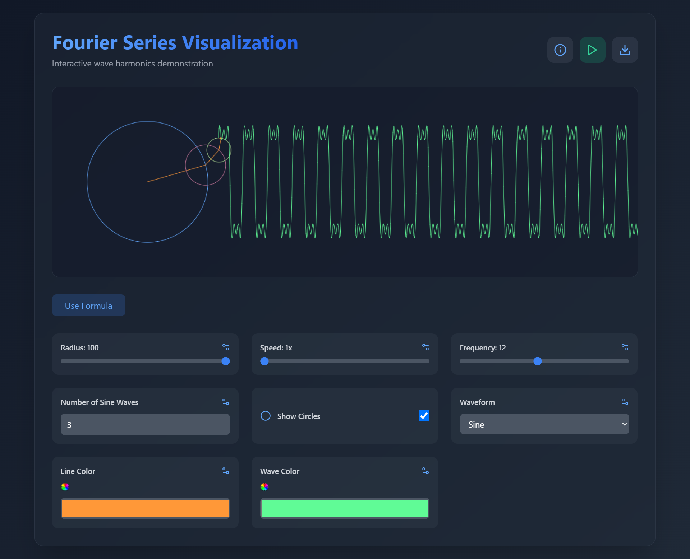

<h1>🌊 Fourier Series Visualization</h1> 

[](https://fourier-series-visualization-pearl.vercel.app/)

  

An interactive visualization of Fourier series harmonics using rotating vectors and wave superposition. Built with cutting-edge web technologies for immersive mathematical exploration.

[](https://react.dev/)
[](https://www.typescriptlang.org/)
[](https://tailwindcss.com/)
[](https://vitejs.dev/)

## 📑 Table of Contents
- [✨ Features](#-features)
- [🚀 Quick Start](#-quick-start)
- [🔧 Customization](#-customization)
- [🧩 Tech Stack](#-tech-stack)
- [📚 Learning Resources](#-learning-resources)
- [🤝 Contributing](#-contributing)
- [📄 License](#-license)
- [📬 Contact](#-contact)

## ✨ Features

### 🌈 Interactive Controls
- 🎮 Real-time parameter adjustments
- 🌐 Responsive canvas rendering
- 🖌️ Color pickers for visual elements
- ⚡ Instant waveform updates

### 📈 Visualization Tools
- 🌀 Rotating harmonic circles
- 🌊 Waveform tracing
- 📉 Real-time graph plotting
- 🔄 Animation controls (Play/Pause)

### 🧮 Mathematical Capabilities
- 📝 Custom formula input (`sin(x) + 0.5*sin(3*x)`)
- 🔢 Predefined waveform library
- 🧪 Math.js integration
- ❗ Error handling for invalid inputs

### 🎨 Design Features
- 🌑 Dark mode aesthetics
- 💫 Framer Motion animations
- 📱 Mobile-responsive layout
- 🖼️ PNG export functionality

## 🚀 Quick Start

### Prerequisites
- Node.js ≥16.x
- npm ≥9.x

### Installation
```bash
# Clone repository
git clone https://github.com/hamzakhaliq-404/Fourier-Series-Visualization.git
cd Fourier-Series-Visualization

# Install dependencies
npm install

# Start development server
npm run dev
```

### Production Build
```bash
npm run build
npm run preview
```

## 🔧 Customization

### Theme Configuration
Modify `tailwind.config.js` for color schemes:
```js
theme: {
  extend: {
    colors: {
      primary: '#60a5fa',
      secondary: '#3b82f6',
      dark: '#1e293b'
    }
  }
}
```

### Add New Waveforms
Extend `predefinedFormulas` in `App.tsx`:
```tsx
const predefinedFormulas = [
  // Add new entries like:
  {
    name: 'Heart Wave ❤️', 
    formula: 'abs(sin(x)) + sqrt(1 - (x/π)^2)'
  }
];
```

## 🧩 Tech Stack

| Category        | Technologies                                                                 |
|-----------------|------------------------------------------------------------------------------|
| **Core**        | React, TypeScript, Vite                                                      |
| **Styling**     | Tailwind CSS, Framer Motion                                                  |
| **Math**        | Math.js, Canvas API                                                          |
| **Deployment**  | Vercel, GitHub Actions                                                       |
| **Quality**     | ESLint, Prettier, TypeScript Strict Mode                                     |

## 📚 Learning Resources

### Fourier Series Concepts
- [3Blue1Brown Fourier Series](https://www.3blue1brown.com/topics/fourier-series)
- [BetterExplained Fourier Guide](https://betterexplained.com/articles/an-interactive-guide-to-the-fourier-transform/)

### Technical Implementation
- [Canvas Animation Best Practices](https://developer.mozilla.org/en-US/docs/Web/API/Canvas_API/Tutorial/Basic_animations)
- [Math.js Documentation](https://mathjs.org/docs/index.html)
- [React Performance Optimization](https://react.dev/learn/performance)

## 🤝 Contributing

We welcome contributions! Please follow these guidelines:

1. Fork the repository 🍴
2. Create your feature branch (`git checkout -b feature/AmazingFeature`)
3. Commit changes (`git commit -m 'Add amazing feature'`)
4. Push to branch (`git push origin feature/AmazingFeature`)
5. Open Pull Request 🚀

See our [Contribution Guidelines](CONTRIBUTING.md) for details.

## 📄 License

Distributed under the MIT License. See [LICENSE](LICENSE) for more information.

## 📬 Contact

**Hamza Khaliq** - [](www.hamza.expert)  
[](mailto:hmza@hamza.expert)  
[](https://github.com/hamzakhaliq-404)

---

Made with ❤️ by [Hamza Khaliq](www.hamza.expert) | [](https://www.buymeacoffee.com/hamzakhaliq)
